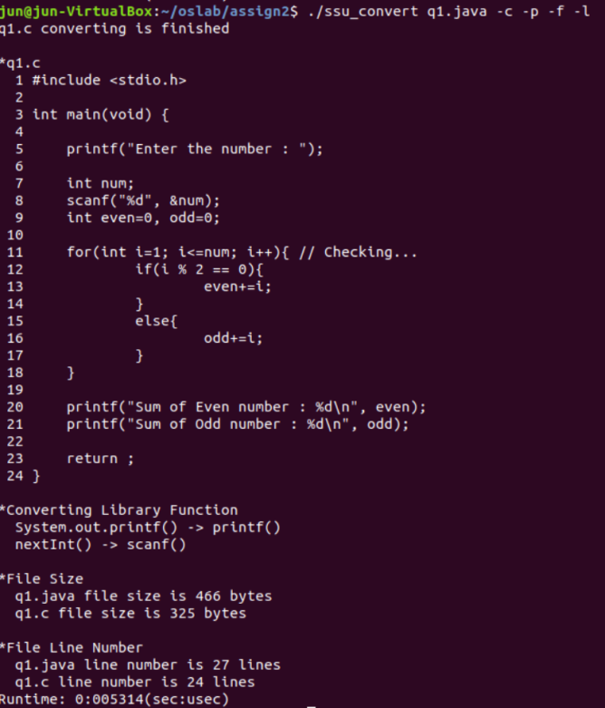
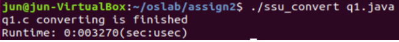
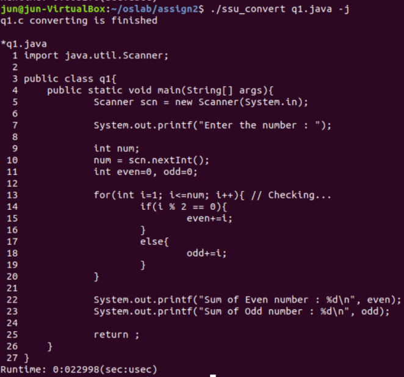
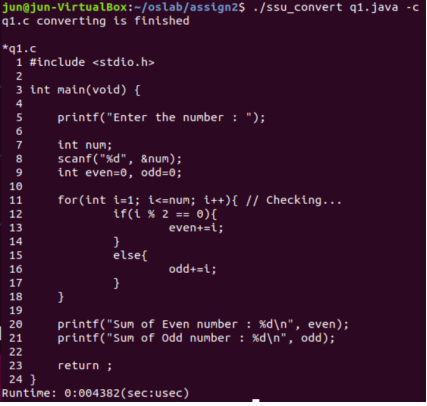
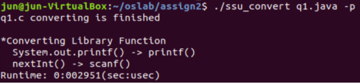
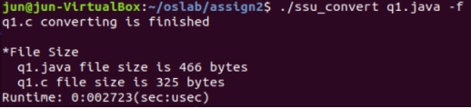
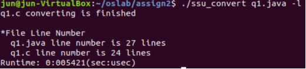
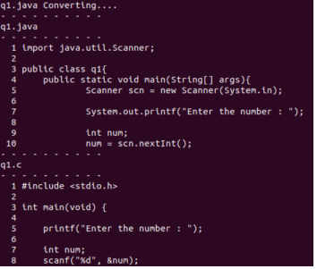

# Automatic Conversion of Java to C Program
This is program that automatic converse .java file to .c file. (Can't change all .java file, it has limitation.)

  - It contains .java files (q1.java, q2.java, q3.java hear).
  - It makes .c files with same name (q1.c ... hear) and Makefile (q1_Makefile ... hear).

## How It Works

### Linux:

  - compile
```sh
make 
```

  - with no options: just converse .java file to .c file
```sh
./ssu_convert.c q1.java
```


  - with `-j` options: converse and print .java file
```sh
./ssu_convert.c q1.java -j
```

    
  - with `-c` options: converse and print conversed .c file
```sh
./ssu_convert.c q1.java -c
```

    
  - with `-p` options: convert and print java and c methods that are relevant
```sh
./ssu_convert.c q1.java -p
```


  - with `-f` options: convert and print size of java and c file
```sh
./ssu_convert.c q1.java -f
```


  - with `-l` options: convert and print the number of lines in java and c file
```sh
./ssu_convert.c q1.java -l
```


  - with `-r` options: convert with print each line that is converting now
```sh
./ssu_convert.c q1.java -r
```

